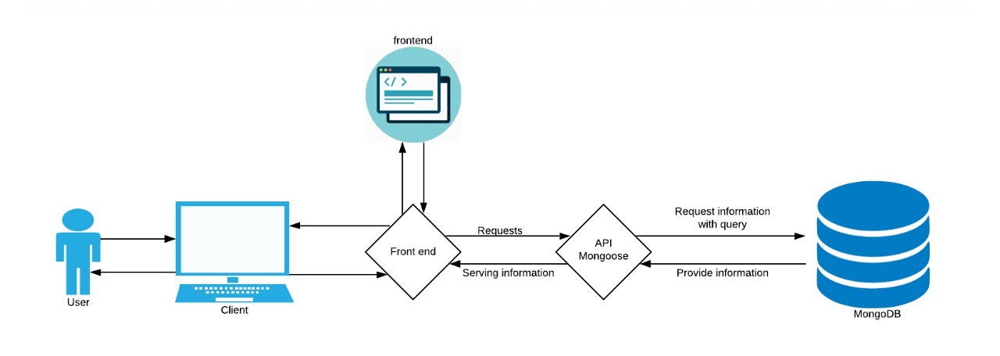
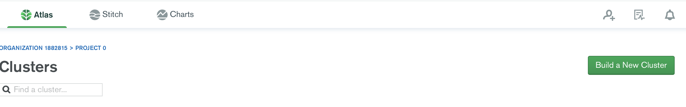
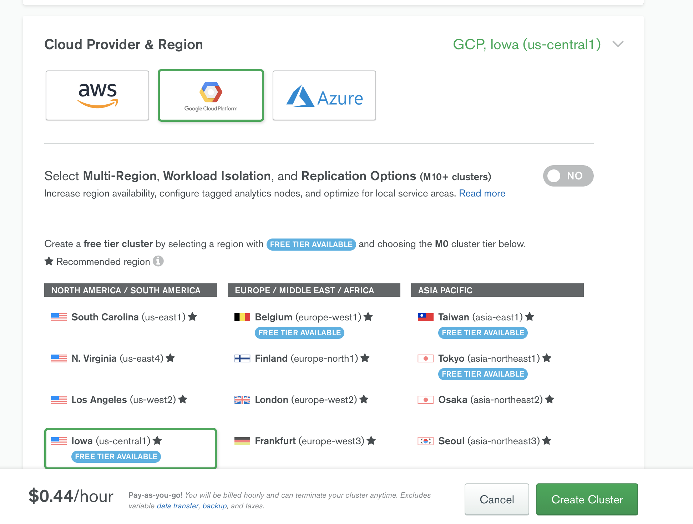
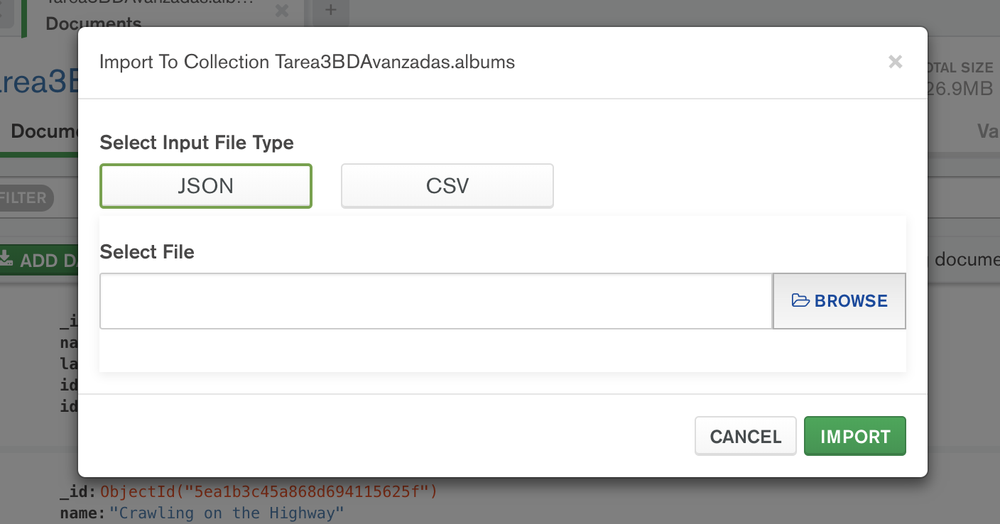

# Tarea 3. Bases de datos NoSQL (MongoDB)

---

##### Integrantes:
1. *[Poner aquí Nombre y Apellidos del integrante 1]* - *[Poner aquí su Matrícula]* - *Campus Santa Fe*
2. *[Poner aquí Nombre y Apellidos del integrante 2]* - *[Poner aquí su Matrícula]* - *Campus Santa Fe*
3. *Yann Le Lorier Bárcena* - *A01025977* - *Campus Santa Fe*
4. *[Poner aquí Nombre y Apellidos del integrante 4]* - *[Poner aquí su Matrícula]* - *Campus Santa Fe*

---
## 1. Aspectos generales

Las orientaciones de la tarea se encuentran disponibles en la plataforma **Canvas**.

Este documento es una guía sobre qué información debe entregar como parte de la tarea, qué requerimientos técnicos debe cumplir y la estructura que debe seguir para organizar su entrega.


### 1.1 Requerimientos técnicos

A continuación se mencionan los requerimientos técnicos mínimos de la tarea, favor de tenerlos presente para que cumpla con todos.

* El equipo tiene la libertad de elegir las tecnologías de desarrollo a utilizar en la tarea, sin embargo, debe tener presente que la solución final se deberá ejecutar en una plataforma en la nube. Puede ser  [Google Cloud Platform](https://cloud.google.com/?hl=es), [Azure](https://azure.microsoft.com/en-us/), [AWS](https://aws.amazon.com/es/free/) u otra.
* La arquitectura de la solución deberá estar separada claramente por capas (*frontend*, *backend*, datos y almacenamiento).
* Todo el código, *scripts* y la documentación de la tarea debe alojarse en este repositorio de GitHub, siguiendo la estructura que aparece a continuación.

### 1.2 Estructura del repositorio

El proyecto debe seguir la siguiente estructura de carpetas:
```
- / 			        # Raíz de toda la tarea
    - README.md			# Archivo con la información general de la tarea (este archivo)
    - frontend			# Carpeta con la solución del frontend (Web app)
    - backend			# Carpeta con la solución del backend (API)
    - scripts		        # Carpeta con los scripts necesarios para generar la base de datos, cargar datos y ejecutar las consultas
    - database			# Carpeta con el modelo de la bases de datos utilizando JSON Schema

```

### 1.3 Documentación de la tarea

Como parte de la entrega de la tarea, se debe incluir la siguiente información:

* Diagrama del *Modelo de la base de datos utilizando JSON Schema*.
* *Scripts* para generar la base de datos, cargar datos y ejecutar consultas.
* Guía de configuración, instalación y despliegue de la aplicación en la plataforma en la nube  seleccionada.
* El código debe estar documentado siguiendo los estándares definidos para el lenguaje de programación seleccionado.

## 2. Solución

A continuación aparecen descritos los diferentes elementos que forman parte de la solución de la tarea.

### 2.1 Modelo de la *base de datos* 

*[Incluya aquí el modelo JSON Schema y explique los patrones utilizados en cada caso.*

### 2.2 Arquitectura de la solución



### 2.3 Frontend

*[Incluya aquí una explicación de la solución utilizada para el frontend de la tarea. No olvide incluir las ligas o referencias donde se puede encontrar información de los lenguajes de programación, frameworks y librerías utilizadas.]*

#### 2.3.1 Lenguaje de programación
#### 2.3.2 Framework
#### 2.3.3 Librerías de funciones o dependencias

### 2.4 Backend
Utilizamos como backend JavaScript, con el ambiente de Node, express y el framework de Mongoose. La conexión con Mongo por medio de Mongoose permite el uso del Aggregation framework. Está implementado de manera a que es muy simple establecer conectividad por medio del código, sobre todo que se puede hacer el deploy de la base de datos directamente de MongoDB Compass.

En gran parte, el modelo que utilizamos para la organización de las rutas fue inspirado en el tutorial que se encuentra [aquí](https://developer.mozilla.org/en-US/docs/Learn/Server-side/Express_Nodejs/routes).

#### 2.4.1 Lenguaje de programación
El lenguage de programación utilizado es JavaScript.
#### 2.4.2 Framework
https://mongoosejs.com/docs/

Mongoose es un framework que permite la conectividad de manera simple a MongoDB. Dentro de sus funciones que más utilizamos están:
- updateOne()
- deleteOne()
- deleteMany()

Se trata de funciones que ya están optimizadas para el funcionamiento de MongoDB, asegurando consultas rápidas.
#### 2.4.3 Librerías de funciones o dependencias
Las dependencias para el funcionamiento correcto de la aplicación son principalemente node, y de preferencia npm y nvm. 

Después, es necesario instalar express y mongoose para npm:
```sh
npm install mongoose --save
```

```sh
npm install express --save
```

## 2.5 Pasos a seguir para utilizar la aplicación

### 2.5.1 Descargar MongoDB Compass
Se puede encontrar en la página de Mongo:
https://www.mongodb.com/products/compass

Se necesitará registrar con usuario y contraseña.

### 2.5.2 Creando un Cluster de MongoDB
Una vez la instalación aplicada, es necesario crear la base de datos:



### 2.5.3 Escogiendo los proveedores de servicio

Puede elegir entre AWS, GCP o Azure, y también puede elegir la región en la que quiere tener el cluster. Este paso es gratis si no tiene aún ningún Cluster.




### 2.5.4 Inserción de datos

Puede jalar información de un archivo CSV o bien de un .json, que encuentra en el siguiente [path](./scripts):



### 2.5.5 Deploy
MISSING

## 3. Referencias

- https://mongoosejs.com/docs/
- https://developer.mozilla.org/en-US/docs/Learn/Server-side/Express_Nodejs/routes
- https://mongoosejs.com/docs/geojson.html
